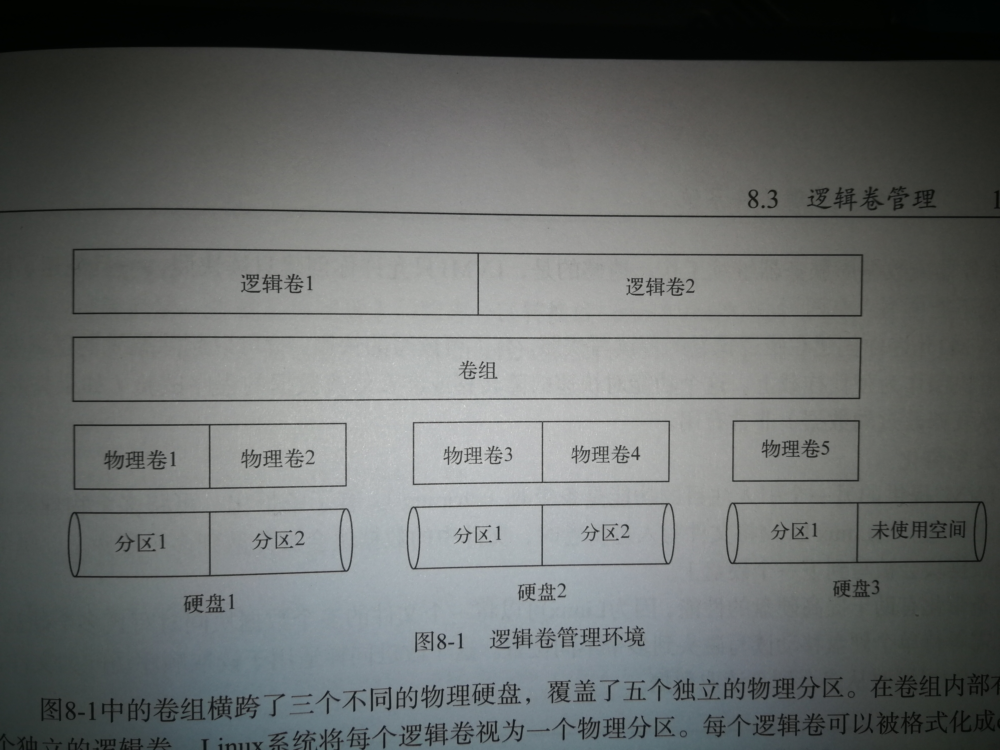

# 管理文件系统

## ext文件系统，日志文件系统

- ext文件系统
  - ext文件系统采用名为索引节点的系统来存放虚拟目录中所存储文件的信息。索引节点系统在每个物理设备中创建一个单独的索引节点表来存储这些文件的信息。这些信息包括：
    - 文件名
    - 文件大小
    - 文件属主
    - 文件属组
    - 文件的访问权限
    - 指向存有文件数据的每个硬盘块的指针
  - 创建文件时，文件系统分配一个唯一的索引节点号，Linux通过此号来标识文件。 
  - 每次更新或存储文件时，都要既更新索引节点表，又要将数据写入存储设备。如果这两者之间发生了问题将有可能丢失数据。
  - ext2,3,4对文件系统的功能做了扩展，包括扩展索引节点的格式以保存文件的更多信息。其中ext3,4使用了日志文件系统以降低丢失数据的风险。

- 日志文件系统
  - 此系统先将文件的更改写入临时文件，在数据成功写到存储设备和索引节点表之后，再删除对应的日志条目。Linux有3种广泛使用的日志方法：
    - 数据模式：索引节点和文件都会被写入日志，风险低，性能差
    - 有序模式：只有索引节点数据写入日志，但只有数据成功写入后才删除；风险和安全性折中
    - 回写模式：只有索引节点数据写入日志，但不控制文件数据合适写入；风险高
  
## 操作文件系统

- lsblk命令：列出当前硬盘信息（包括存储设备和分区）
  ```sh
  $ lsblk
  NAME        MAJ:MIN RM   SIZE RO TYPE MOUNTPOINT
  ...
  sda           8:0    0 931.5G  0 disk 
  ├─sda1        8:1    0 781.5G  0 part /media/xlew/Vseagate
  ├─sda2        8:2    0     1K  0 part 
  ├─sda5        8:5    0     4G  0 part [SWAP]
  ├─sda6        8:6    0   512M  0 part 
  ├─sda7        8:7    0   100G  0 part /home
  ├─sda8        8:8    0    20G  0 part /usr
  └─sda9        8:9    0    25G  0 part /
  nvme0n1     259:0    0 238.5G  0 disk 
  ├─nvme0n1p1 259:1    0   260M  0 part /boot/efi
  ├─nvme0n1p2 259:2    0    16M  0 part 
  ├─nvme0n1p3 259:3    0   120G  0 part 
  ├─nvme0n1p4 259:4    0 117.2G  0 part 
  └─nvme0n1p5 259:5    0  1000M  0 part 
  ```
- df命令：查看分区使用情况
  ```sh
  $ df
  文件系统           1K-块      已用      可用 已用% 挂载点
  /dev/sda9       25671968   7419804  16925064   31% /
  /dev/sda8       20511328   5334076  14112296   28% /usr
  ...
  /dev/nvme0n1p1    262144     35404    226740   14% /boot/efi
  /dev/sda7      103081220  43174048  54647912   45% /home
  tmpfs             806156        16    806140    1% /run/user/121
  tmpfs             806156        40    806116    1% /run/user/1000
  /dev/sda1      819473404 542631344 276842060   67% /media/xlew/Vseagate
  ```
- fdisk命令：对文件系统进行操作
  - 进入设备：
    ```
    $ sudo fdisk /dev/sda
    [sudo] xlew 的密码：

    欢迎使用 fdisk (util-linux 2.31.1)。
    更改将停留在内存中，直到您决定将更改写入磁盘。
    使用写入命令前请三思。

    命令(输入 m 获取帮助)： 
    ```    
  - fdisk部分选项：
    |命令|描述|
    |---|---|
    |d|删除分区|
    |l|显示可用的分区类型|
    |m|显示命令选项|
    |n|添加一个新分区|
    |p|显示当前分区表|
    |q|退出，不保存更改|
    |w|将分区表写入磁盘|
  
- 使用fdisk命令创建新分区，格式化新分区并挂载的步骤见《Linux命令行与Shell脚本编程大全》第三版P149-152
  - 格式化（创建文件系统）的命令行程序（ext4）：mkfs.ext4
    ```sh
    $ sudo mkfs.ext4 /dev/sdax
    ```

- 文件系统的修复与检查：fsck命令
  - 详情见《Linux编程大全》P153

## 逻辑卷管理

- 为什么使用‘逻辑卷’？
  - 如果用标准分区在硬盘上创建了文件系统，就只能在同一个物理硬盘的可用空间范围内调整分区大小。如果硬盘没地方了只能弄一个更大的硬盘
  - 逻辑卷的思想是把多个物理硬盘“拼”成一整个大硬盘，在这个大硬盘上再进行类似的分区挂载操作，步骤大致如下（见《Linux编程大全》P157）：
    - 使用fdisk命令建立分区，并使用LVM2软件包的pvcreate命令创建实际的物理卷
    - 使用LVM2的vgcreate命令从物理卷中创建卷组（即“大硬盘”）
    - 使用LVM2的lvcreate命令在卷组中创建逻辑卷
    - 使用相应的工具（如mkfs.ext4）创建文件系统（格式化）
    - 使用mount命令挂载创建的逻辑卷
<center>

</center>