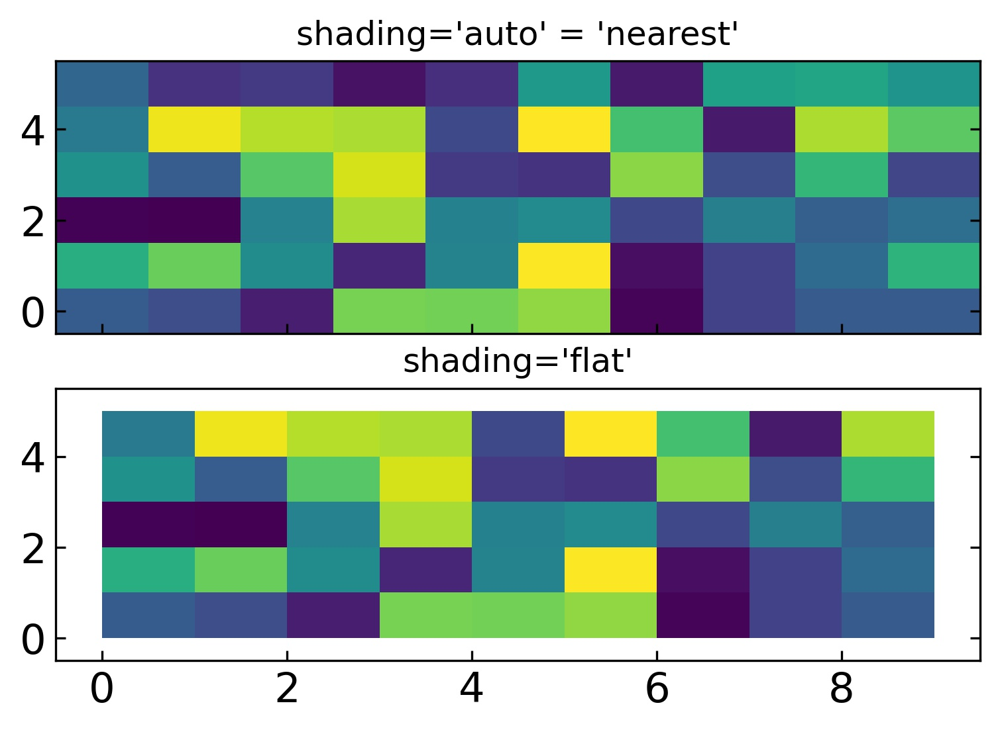

[TOC]

### 如何设置坐标轴刻度

```python
import matplotlib.pyplot as plt
from matplotlib.pyplot import MultipleLocator

fig2 = plt.figure(figsize=(15,10))
plt.plot(freqs, ps)
plt.xlabel('frequency(circle/second)', fontsize=18)
plt.title('Power spectrum (np.fft.fft)', fontsize=20)
#把x轴的刻度间隔设置为1，并存在变量里
x_major_locator=MultipleLocator(1)
## 把y轴的刻度间隔设置为10，并存在变量里
y_major_locator=MultipleLocator(10)
#ax为两条坐标轴的实例
ax=plt.gca()
#把x轴的主刻度设置为1的倍数
ax.xaxis.set_major_locator(x_major_locator)
## 把y轴的主刻度设置为10的倍数
ax.yaxis.set_major_locator(y_major_locator)
plt.xlim(-31,31)
plt.show()

## 原参考:https://www.jb51.net/article/163842.htm
x_values=list(range(11))
y_values=[x**2 for x in x_values]
plt.plot(x_values,y_values,c='green')
plt.title('Squares',fontsize=24)
plt.tick_params(axis='both',which='major',labelsize=14)
plt.xlabel('Numbers',fontsize=14)
plt.ylabel('Squares',fontsize=14)
x_major_locator=MultipleLocator(1)
#把x轴的刻度间隔设置为1，并存在变量里
y_major_locator=MultipleLocator(10)
#把y轴的刻度间隔设置为10，并存在变量里
ax=plt.gca()
#ax为两条坐标轴的实例
ax.xaxis.set_major_locator(x_major_locator)
#把x轴的主刻度设置为1的倍数
ax.yaxis.set_major_locator(y_major_locator)
#把y轴的主刻度设置为10的倍数
plt.xlim(-0.5,11)
#把x轴的刻度范围设置为-0.5到11，因为0.5不满一个刻度间隔，所以数字不会显示出来，但是能看到一点空白
plt.ylim(-5,110)
#把y轴的刻度范围设置为-5到110，同理，-5不会标出来，但是能看到一点空白
plt.show()

```

### 常用fontsize

```python
import matplotlib.pyplot as plt
import matplotlib
matplotlib.rc('xtick', labelsize=15) 
matplotlib.rc('ytick', labelsize=15) 

fig2 = plt.figure(figsize=(15,7))
ax1 = fig2.add_subplot(121)
ax1.hist(d_sample[201:], bins=50)
ax1.set_xlabel(r'$d(pc)$', fontsize=18)
ax1.set_ylabel(r'$counts$', fontsize=18)
ax1.set_title(r'$distance\ distribution\ from\ sampling$', fontsize=20)

ax2 = fig2.add_subplot(122)
d = np.arange(1000, 2500, 1)
ax2.plot(d, func_fd(d), linewidth=3)
ax2.set_xlabel(r'$d(pc)$', fontsize=18)
ax2.set_ylabel(r'$P(d)$', fontsize=18)
ax2.set_title(r'$theoretical\ PDF\ of\ distance$', fontsize=20)
fig2.savefig('distance_distribution.png',bbox_inches='tight', dpi=300)

# or

fig = plt.figure(figsize=(21,7))
ax1 = fig.add_subplot(131)
ax1.hist(uni_sample[-1], bins=15, label=r'$min=0,\ max=12$')
ax1.set_xlabel(r'$x$', fontsize=12)
ax1.set_ylabel(r'$counts$', fontsize=12)
ax1.set_title(r'$uniform$', fontsize=15)
ax1.legend(prop = {'size':10})

ax2 = fig.add_subplot(132)
ax2.hist(pos_sample[-1], bins=15, label=r'$\lambda=10$')
ax2.set_xlabel(r'$x$', fontsize=12)
ax2.set_ylabel(r'$counts$', fontsize=12)
ax2.set_title(r'$poisson$', fontsize=15)
ax2.legend(prop = {'size':10})

ax3 = fig.add_subplot(133)
ax3.hist(exp_sample[-1], bins=15, label=r'$\theta=3$')
ax3.set_xlabel(r'$x$', fontsize=12)
ax3.set_ylabel(r'$counts$', fontsize=12)
ax3.set_title(r'$exponential$', fontsize=15)
ax3.legend(prop = {'size':10})

# or 

fig3 = plt.figure(figsize=(12,12))
plt.bar(x, res.cumcount/res.cumcount.max(), width=res.binsize, label=r'sampling')
plt.plot(d, cdf, linewidth=2, color='r', label=r'theory')
plt.xlabel(r'$d(pc)$', fontsize=18)
plt.ylabel(r'$cdf$', fontsize=18)
plt.legend(fontsize=18)
plt.title(r'$cumulative\ distribution\ of\ distance$', fontsize=20)
fig3.savefig('cdf.png',bbox_inches='tight', dpi=300)
```

### errorbars

```python
figure=plt.figure(figsize=(15,7))
ax1=figure.add_subplot(121)
ax1.errorbar(x,y,yerr=yer,ecolor='blue',marker='.',mfc='blue',linestyle='none',label='target') # ls='none'指取消默认的连线
```

### 自定义字符串作为轴刻度

```python
x=["one","two","three"]
l=[1,2,3]
y=[2,3,4]

ax=plt.figure().add_subplot(111)
ax.plot(l, y)

# Set the tick positions
ax.set_xticks(l)

# Set the tick labels
ax.set_xticklabels(x)
```

### 设置刻度的朝向

```python
import matplotlib.pyplot as plt

plt.rcParams['ytick.direction'] = 'in' # y轴刻度朝里
plt.rcParams['xtick.direction'] = 'in' # x轴刻度朝里

### 或者通过axe对象的tick_params方法中的direction参数:

ax.tick_params(axis='both',which='major',direction='in',width=1,length=20) 
ax.tick_params(axis='both',which='minor',direction='in',width=0.7,length=10)

# 可选的朝向: 'in','out','inout'
```

### 隐藏/显示坐标轴刻度/坐标

```python
import matplotlib.pyplot as plt
ax.get_xaxis().set_visible(False)
ax.get_yaxis().set_visible(False)

ax.yaxis.tick_right() # 右边y轴显示坐标刻度

### 或者通过rcParams设置
plt.rcParams['ytick.left'] = plt.rcParams['xtick.left'] = False
plt.rcParams['ytick.labelright'] = plt.rcParams['xtick.labelright'] = False
plt.rcParams['ytick.right'] = True # 使用此方法可以显示上边和右边的刻度
```

### 设置主副坐标刻度, 并设置相关刻度的宽度长度

```python
import matplotlib.pyplot as plt
#from matplotlib.pyplot import MultipleLocator
from matplotlib.ticker import (MultipleLocator, AutoMinorLocator)

ax1.yaxis.set_major_locator(MultipleLocator(0.5)) # 设置主刻度为0.5的倍数
ax1.yaxis.set_major_formatter('{x:.1f}') # 主刻度坐标显示的格式:一位小数
# For the minor ticks, use no labels; default NullFormatter.
ax1.yaxis.set_minor_locator(MultipleLocator(0.1)) # 副刻度为0.1的倍数,默认不显示副刻度坐标

ax1.xaxis.set_major_locator(MultipleLocator(100))
ax1.xaxis.set_major_formatter('{x:.0f}')
# For the minor ticks, use no labels; default NullFormatter.
ax1.xaxis.set_minor_locator(MultipleLocator(20))

# 设置主副刻度的长宽,朝向等
ax1.tick_params(axis='y',which='major',direction='in',width=1,length=20) 
ax1.tick_params(axis='y',which='minor',direction='in',width=0.7,length=10)
ax1.tick_params(axis='x',which='both',direction='in',width=1.2)
```

### [Major and minor ticks](https://matplotlib.org/stable/gallery/ticks_and_spines/major_minor_demo.html#sphx-glr-gallery-ticks-and-spines-major-minor-demo-py)

```python
import matplotlib.pyplot as plt
import numpy as np
from matplotlib.ticker import (MultipleLocator, AutoMinorLocator)


t = np.arange(0.0, 100.0, 0.1)
s = np.sin(0.1 * np.pi * t) * np.exp(-t * 0.01)

fig, ax = plt.subplots()
ax.plot(t, s)

# Make a plot with major ticks that are multiples of 20 and minor ticks that
# are multiples of 5.  Label major ticks with '.0f' formatting but don't label
# minor ticks.  The string is used directly, the `StrMethodFormatter` is
# created automatically.
ax.xaxis.set_major_locator(MultipleLocator(20))
ax.xaxis.set_major_formatter('{x:.0f}')

# For the minor ticks, use no labels; default NullFormatter.
ax.xaxis.set_minor_locator(MultipleLocator(5))

plt.show()
```

### 坐标字符串倾斜

```python
for tick in ax.get_xticklabels():  # 将横坐标倾斜45度，纵坐标可用相同方法
    tick.set_rotation(45)
```

### 创建无缝连接的图像1

https://matplotlib.org/stable/gallery/subplots_axes_and_figures/ganged_plots.html#sphx-glr-gallery-subplots-axes-and-figures-ganged-plots-py

```python
import matplotlib.pyplot as plt
import numpy as np

t = np.arange(0.0, 2.0, 0.01)

s1 = np.sin(2 * np.pi * t)
s2 = np.exp(-t)
s3 = s1 * s2

fig, axs = plt.subplots(3, 1, sharex=True)
# Remove horizontal space between axes
fig.subplots_adjust(hspace=0)

# Plot each graph, and manually set the y tick values
axs[0].plot(t, s1)
axs[0].set_yticks(np.arange(-0.9, 1.0, 0.4))
axs[0].set_ylim(-1, 1)

axs[1].plot(t, s2)
axs[1].set_yticks(np.arange(0.1, 1.0, 0.2))
axs[1].set_ylim(0, 1)

axs[2].plot(t, s3)
axs[2].set_yticks(np.arange(-0.9, 1.0, 0.4))
axs[2].set_ylim(-1, 1)

plt.show()
```

### 创建无缝连接的图像2

https://matplotlib.org/stable/gallery/subplots_axes_and_figures/subplots_demo.html#sphx-glr-gallery-subplots-axes-and-figures-subplots-demo-py

```python
fig = plt.figure()
gs = fig.add_gridspec(3, hspace=0)
axs = gs.subplots(sharex=True, sharey=True)
fig.suptitle('Sharing both axes')
axs[0].plot(x, y ** 2)
axs[1].plot(x, 0.3 * y, 'o')
axs[2].plot(x, y, '+')

# Hide x labels and tick labels for all but bottom plot.
for ax in axs:
    ax.label_outer()
```

### 画横条图

https://matplotlib.org/stable/gallery/lines_bars_and_markers/barh.html#sphx-glr-gallery-lines-bars-and-markers-barh-py

```python
from matplotlib.pyplot import MultipleLocator

fig3, ax6 = plt.subplots(figsize=(15,15))

ax6.set_xscale("log")
#ax6.scatter(t90, x, marker='x', color='b', label='t90')
ax6.barh(x, t90, height=0.3, fill=False, edgecolor='dodgerblue', label=r'$T_{90}$') # height 指横条的宽度
#ax6.hist(x, t90, marker='x', color='b', label='t90')
ax6.set_yticks(x)
ax6.set_yticklabels([name.split(' ')[-1] for name in grbname])
ax6.grid(True, linestyle='-.')
```


### 多图布局

```python
import matplotlib.pyplot as plt
from matplotlib.gridspec import GridSpec


def format_axes(fig):
    for i, ax in enumerate(fig.axes):
        #ax.text(0.5, 0.5, "ax%d" % (i+1), va="center", ha="center")
        #ax.tick_params(labelbottom=False, labelleft=False)
        pass

fig = plt.figure(constrained_layout=True, figsize=(22,10))

gs = GridSpec(4, 2, figure=fig)

ax1 = fig.add_subplot(gs[0, 0])
ax1.scatter(x, t90, marker='x')
ax1.set_xticks(x)
ax1.set_xticklabels([name.split(' ')[-1] for name in grbname])
ax1.set_ylabel('t90', fontsize=15)
ax1.grid(True, linestyle='-.')
ax1.tick_params(labelbottom=False, labelleft=True)


ax2 = fig.add_subplot(gs[1,0])
ax2.scatter(x, tobs, marker='x', color='g')
ax2.set_xticks(x)
ax2.set_xticklabels([name.split(' ')[-1] for name in grbname])
ax2.set_ylabel('tobs', fontsize=15)
ax2.grid(True, linestyle='-.')
ax2.tick_params(labelbottom=False, labelleft=True)

ax3 = fig.add_subplot(gs[2,0])
ax3.scatter(x, mag, marker='x', color='m')
ax3.set_xticks(x)
ax3.set_xticklabels([name.split(' ')[-1] for name in grbname])
ax3.set_ylabel('mag', fontsize=15)
ax3.grid(True, linestyle='-.')
ax3.tick_params(labelbottom=False, labelleft=True)

ax4 = fig.add_subplot(gs[3,0])
ax4.scatter(x, z, marker='x', color='r')
ax4.set_xticks(x)
ax4.set_xticklabels([name.split(' ')[-1] for name in grbname])
for tick in ax4.get_xticklabels():  # 将横坐标倾斜30度，纵坐标可用相同方法
    tick.set_rotation(45)
ax4.set_ylabel('redshift', fontsize=15)
ax4.grid(True, linestyle='-.')
ax4.tick_params(labelbottom=True, labelleft=True)

ax5 = fig.add_subplot(gs[:,1])
ax5.scatter(tobs, t90, color='orange')
ax5.set_xlabel('tobs',fontsize=15)
ax5.set_ylabel('t90', fontsize=15)
#ax2.set_ylim(0,1000)
#ax2.set_xlim(0,1000)
ax5.plot(np.linspace(1,500,500),np.linspace(1,500,500), linestyle='--', color='k', label='t90=tobs')
ax5.legend(prop={'size':13})

#fig.suptitle("GridSpec")
format_axes(fig)

plt.suptitle('GRBs automatically observed by NEXT',fontsize=18)
plt.show()
fig.savefig('next_auto.jpg',bbox_inches='tight',dpi=300)
```


完整示例: /home/liuxing/git/program101/python101/matplotlib_examples/next_gridspec_barh.ipynb

### [使用gridspec自定义图像布局](https://matplotlib.org/stable/tutorials/intermediate/gridspec.html?highlight=customize%20gridspec%20subplots)

可以在一个fig中添加多个gridspec,再往每个gridspec里面添加多个axes

```python
import matplotlib.pyplot  as plt

fig = plt.figure(figsize=(40,20),constrained_layout=False)

gs1 = fig.add_gridspec(nrows=2, ncols=1,top=59/60, bottom=51/60,hspace=0,height_ratios=[1,3])
ax1 = fig.add_subplot(gs1[0,0])
ax2 = fig.add_subplot(gs1[1,0],sharex=ax1)

gs2 = fig.add_gridspec(nrows=2, ncols=1,top=49/60, bottom=41/60,hspace=0,height_ratios=[1,3])
ax3 = fig.add_subplot(gs2[0,0])
ax4 = fig.add_subplot(gs2[1,0],sharex=ax3)

gs3 = fig.add_gridspec(nrows=2, ncols=1,top=39/60, bottom=31/60,hspace=0,height_ratios=[1,3])
ax5 = fig.add_subplot(gs3[0,0])
ax6 = fig.add_subplot(gs3[1,0],sharex=ax5)

gs4 = fig.add_gridspec(nrows=2, ncols=1,top=29/60, bottom=21/60,hspace=0,height_ratios=[1,3])
ax7 = fig.add_subplot(gs4[0,0])
ax8 = fig.add_subplot(gs4[1,0],sharex=ax7)

gs5 = fig.add_gridspec(nrows=2, ncols=1,top=19/60, bottom=11/60,hspace=0,height_ratios=[1,3])
ax9 = fig.add_subplot(gs5[0,0])
ax10 = fig.add_subplot(gs5[1,0],sharex=ax9)

gs6 = fig.add_gridspec(nrows=2, ncols=1,top=9/60, bottom=1/60,hspace=0,height_ratios=[1,3])
ax11 = fig.add_subplot(gs6[0,0])
ax12 = fig.add_subplot(gs6[1,0],sharex=ax11)


### 或者使用循环:
figl = plt.figure(figsize=(40,20),constrained_layout=False)
plt.rcParams['xtick.labelsize']=15 
plt.rcParams['ytick.labelsize']=15 
plt.rcParams['ytick.direction'] = 'in' # y轴刻度朝里
plt.rcParams['xtick.direction'] = 'in' # x轴刻度朝里
plt.rcParams['ytick.right'] = plt.rcParams['ytick.labelright'] = True # 右边y轴显示坐标刻度和标记
plt.rcParams['ytick.right'] = True # 右边y轴显示坐标刻度
plt.rcParams['ytick.labelright'] = False
for i in range(6):
    gs1 = figl.add_gridspec(nrows=2, ncols=1,top=(1+15*(59-10*i)/60)/16, bottom=(1+15*(51-10*i)/60)/16,hspace=0,height_ratios=[1,3])
    ax1 = figl.add_subplot(gs1[0,0])
    ax2 = figl.add_subplot(gs1[1,0],sharex=ax1)

figl.supxlabel(r'Observed wavelength ($\AA$)', fontsize=22, y=0.03)
figl.supylabel('Normalised flux', fontsize=22,x=0.1)
plt.savefig('xshooter_spec.jpg',bbox_inches='tight',dpi=100)
```


### 画三维平面图使用自定义坐标: pcolormesh

```python
import matplotlib.pyplot.as plt

x = np.arange(10)  # len = 10
y = np.arange(6)  # len = 6
X, Y = np.meshgrid(x, y) #也可以不使用meshgrid, 后面画图直接使用x,y,Z
Z = np.random.rand(6, 10)

fig, axs = plt.subplots(2, 1, sharex=True, sharey=True)
axs[0].pcolormesh(X, Y, Z, vmin=np.min(Z), vmax=np.max(Z), shading='auto') # 使用shading='auto'是因为这里X,Y的长度与Z的尺寸是一样的, 正常情况下是X,Y长度比Z尺寸各大1
axs[0].set_title("shading='auto' = 'nearest'") 

axs[1].pcolormesh(X, Y, Z[:-1, :-1], vmin=np.min(Z), vmax=np.max(Z),
                  shading='flat')
axs[1].set_title("shading='flat'")
```


实例:/home/liuxing/git/program101/python101/matplotlib/draw_spec.ipynb


### 可选的几个colormap归一化方法, 用于调对比度

```python
import matplotlib.pyplot as plt
import matplotlib.colors as colors
from matplotlib.colors import BoundaryNorm
from matplotlib.ticker import MaxNLocator

figt,  (axt, axt2, axt3, axt4, axt5, axt6)= plt.subplots(6,1,figsize=(30,6)) #(axt, axt2, axt3, axt4, axt5, axt6)

levels = MaxNLocator(nbins=15).tick_values(vmin=-1.e-18, vmax=2.e-18)
cmap = plt.get_cmap('binary')
norm = BoundaryNorm(levels, ncolors=cmap.N, clip=True) # 这种norm不把data映射到0,1之间, 而是映射为整数

axt.pcolormesh(wl_uvb,cy_uvb,data_uvb, shading='auto',cmap=cmap, norm=norm)#, vmin=-2.e-17, vmax=2.e-18)
axt2.pcolormesh(wl_uvb,cy_uvb,data_uvb, shading='auto',cmap='Spectral_r', vmin=-2.e-17, vmax=2.e-18) # 线性的normalization
axt3.pcolormesh(wl_uvb,cy_uvb,data_uvb, shading='auto',cmap='binary', norm=colors.LogNorm(vmin=1.e-50, vmax=2.e-18))
axt4.pcolormesh(wl_uvb,cy_uvb,data_uvb, shading='auto',cmap='binary', norm=colors.CenteredNorm(1.e-20, 2.e-18))
axt5.pcolormesh(wl_uvb,cy_uvb,data_uvb, shading='auto',cmap='binary', norm=colors.SymLogNorm(linthresh=1.e-20,linscale=1.e-6, vmin=-1.e-17, vmax=2.e-18))
axt6.pcolormesh(wl_uvb,cy_uvb,data_uvb, shading='auto',cmap='binary', norm=colors.PowerNorm(gamma=0.99,vmin=1.e-23, vmax=2.e-18))
```


### 在图像里再画一个inset小图

> 主要使用`from mpl_toolkits.axes_grid1.inset_locator import inset_axes`

官方示例:https://matplotlib.org/stable/gallery/axes_grid1/inset_locator_demo.html#sphx-glr-gallery-axes-grid1-inset-locator-demo-py

```python
import numpy as np
import matplotlib as mpl
import matplotlib.pyplot as plt
from matplotlib.ticker import (MultipleLocator, AutoMinorLocator)
from mpl_toolkits.axes_grid1.inset_locator import inset_axes
def inset_plot(width, height,text,fontsize,ax):
    """
    plot a inset at the bottom left corner with 0 padding
    
    Parameters:
    ----------
    width: float
        the ratio of inset width w.r.t the parent axe's x axis
    
    height: float
        the ratio of inset height w.r.t the parent axe's y axis
    
    text: str
        the text displayed at the center of the inset
    
    fontsize: float
    
    ax: plt.ax
        the ax the inset will be added to
    """
    width='{}%'.format(width*100)
    height='{}%'.format(height*100)
    
    axins = inset_axes(ax, width=width, height=height, loc=3, borderpad=0)
    axins.tick_params(labelleft=False, labelbottom=False, length=0)
    axins.text(0.5,0.5,text,size=fontsize, ha='center',va='center')


fig, ax = plt.subplots(figsize=[7,3])
# axins2 = inset_axes(ax, width="25%", height="40.0%", loc=3,borderpad=0)
# axins2.tick_params(labelleft=False, labelbottom=False, length=0)
# axins2.text(0.5,0.5,'test',va='center', ha='center')
inset_plot(0.25,0.4,'t',10,ax)
plt.show()
```


### 用np.meshgrid()画网格 
https://stackoverflow.com/questions/59327021/how-to-plot-a-2d-structured-mesh-in-matplotlib

```python
x, y = np.meshgrid(np.linspace(corner_en[0], corner_wn[0], int(fov_ra*60.0/5+1)), np.linspace(corner_es[1], corner_en[1], int(fov_dec*60.0/5+1)))
fig=plt.figure(figsize=(20*(fov_ra/(fov_ra+fov_dec)),20*(fov_dec/(fov_ra+fov_dec))))
ax1=fig.add_subplot()
ax1.vlines(x[0], *y[[0,-1],0], color='grey', lw=0.5) # '*'在这里表示解包
ax1.hlines(y[:,0], *x[0, [0,-1]], color='grey', lw=0.5)
```

### 设置两轴比例尺相同

https://matplotlib.org/stable/gallery/subplots_axes_and_figures/axis_equal_demo.html

`ax.axis('equal')` or `ax.set_aspect('equal','box')`

```python
fig=plt.figure(figsize=(20*(fov_ra/(fov_ra+fov_dec)),20*(fov_dec/(fov_ra+fov_dec))))
ax1=fig.add_subplot()

ax1.vlines(x[0], *y[[0,-1],0], color='grey', lw=0.5)
ax1.hlines(y[:,0], *x[0, [0,-1]], color='grey', lw=0.5)

ax1.scatter(ar_ra_refcat, ar_dec_refcat, marker='.', s=6, label='empty {}/{}={:.4f}'.format(empties, total, empties/total))
ax1.hlines(corner_en[1], corner_wn[0], corner_en[0], color='r', ls='--')
ax1.hlines(corner_es[1], corner_ws[0], corner_es[0], color='r', ls='--')
ax1.vlines(corner_en[0], corner_es[1], corner_en[1], color='r', ls='--')
ax1.vlines(corner_wn[0], corner_ws[1], corner_wn[1], color='r', ls='--')
ax1.text(ra_cen, dec_cen, id, ha='center', va='center', fontsize=18)
#ax1.set_xlim(ra_cen-1.1*fov_ra,ra_cen+1.1*fov_ra)
#ax1.set_ylim(dec_cen-1.1*fov_dec,dec_cen+1.1*fov_dec)
ax1.legend(prop={'size':16})

ax1.set_aspect('equal','box') # set equa aspect ratio, https://matplotlib.org/stable/gallery/subplots_axes_and_figures/axis_equal_demo.html
ax1.xaxis.set_major_locator(MultipleLocator(0.25))
ax1.yaxis.set_major_locator(MultipleLocator(0.25))

ax1.invert_xaxis()
fig.savefig(fig_ldac,bbox_inches='tight',dpi=300)
```

### 设置坐标刻度不可见

```python
ax.get_xaxis().set_visible(False)
ax.get_yaxis().set_visible(False)
```

### 给图像加水印
https://matplotlib.org/stable/gallery/subplots_axes_and_figures/custom_figure_class.html#sphx-glr-gallery-subplots-axes-and-figures-custom-figure-class-py

```python
import matplotlib.pyplot as plt
from matplotlib.figure import Figure
import numpy as np


class WatermarkFigure(Figure):
    """A figure with a text watermark."""

    def __init__(self, *args, watermark=None, **kwargs):
        super().__init__(*args, **kwargs)

        if watermark is not None:
            bbox = dict(boxstyle='square', lw=3, ec='gray',
                        fc=(0.9, 0.9, .9, .5), alpha=0.5)
            self.text(0.5, 0.5, watermark,
                      ha='center', va='center', rotation=30,
                      fontsize=40, color='gray', alpha=0.5, bbox=bbox)


x = np.linspace(-3, 3, 201)
y = np.tanh(x) + 0.1 * np.cos(5 * x)

plt.figure(FigureClass=WatermarkFigure, watermark='draft')
plt.plot(x, y)
```

### 对图像(数组)进行高斯平滑

```python
from scipy.ndimage import gaussian_filter
im_conved = gaussian_filter(image, sigma=1)
```

### 旋转图像

https://matplotlib.org/stable/gallery/images_contours_and_fields/affine_image.html#sphx-glr-gallery-images-contours-and-fields-affine-image-py

```python
import numpy as np
import matplotlib.pyplot as plt
import matplotlib.transforms as mtransforms

def get_image():
    delta = 0.25
    x = y = np.arange(-3.0, 3.0, delta)
    X, Y = np.meshgrid(x, y)
    Z1 = np.exp(-X**2 - Y**2)
    Z2 = np.exp(-(X - 1)**2 - (Y - 1)**2)
    Z = (Z1 - Z2)
    return Z

# prepare image and figure
fig,ax = plt.subplots()
Z = get_image()

# image rotation
transform = mtransforms.Affine2D().rotate_deg(30)

im = ax.imshow(Z, interpolation='none',
                origin='lower',
                extent=[-2, 4, -3, 2], clip_on=True)

trans_data = transform + ax.transData
im.set_transform(trans_data)

# display intended extent of the image
x1, x2, y1, y2 = im.get_extent()
ax.plot([x1, x2, x2, x1, x1], [y1, y1, y2, y2, y1], "y--",
        transform=trans_data)
ax.set_xlim(-5, 5)
ax.set_ylim(-4, 4)

plt.show()
```

### 在imshow图像上画圆
https://matplotlib.org/stable/gallery/showcase/anatomy.html#sphx-glr-gallery-showcase-anatomy-py

```python
import matplotlib.pyplot as plt
from matplotlib.patches import Circle
from matplotlib.patheffects import withStroke

royal_blue = "#002082"
royal_blue = [0, 20/256, 82/256]

def text(x, y, ax, text):
    ax.text(x, y, text, zorder=100,
            ha='center', va='top', weight='bold', color=royal_blue,
            style='italic', fontfamily='monospace',
            path_effects=[withStroke(linewidth=7, foreground=(1, 1, 1, 1))])


def circle(x, y, ax, radius=0.15):
    c = Circle((x, y), radius, clip_on=False, zorder=10, linewidth=2.5,
               edgecolor='red', facecolor='none')
               #path_effects=[withStroke(linewidth=7, foreground=(1, 1, 1, 1))])
    ax.add_artist(c)

fig,ax1=plt.subplots()
ax1.imshow(data)
circle(46,-96,ax1,radius=6) # 画圆
```